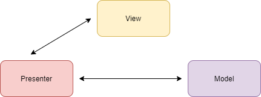

## 1 MVC

MVC： Model - View - Controller，是模型(model)－视图(view)－控制器(controller)的缩写，一种软件设计典范，用一种业务逻辑、数据、界面显示分离的方法组织代码，将业务逻辑聚集到一个部件里面，在改进和个性化定制界面及用户交互的同时，不需要重新编写业务逻辑。MVC被独特的发展起来用于映射传统的输入、处理和输出功能在一个逻辑的图形化用户界面的结构中。

* 模型层（Model）：针对业务建立的数据结构和相关的类；

* 视图层（View）：显示界面（XML 布局文件 或 Java 建立的界面）；

* 控制层（Controller）：Android 通常在 Activity、Fragment 中控制业务；

Android 中 MVC 的缺点：

* View 层和 Model 层耦合，不利于维护。
* 实际开发中 Activity、Fragment 作为控制层，耦合了太多的业务， 往往可能有几千行代码。

## 2 MVP

MVP ：Model - View - Presenter，是 MVC 演化的版本，使用 MVP 时 View 和 Model 不再耦合，View 和 Model 通过 Presenter  进行交互。

* Model：提供数据的存取功能，Presenter 通过 Model 获取、存储数据；
* View：负责处理用户事件和视图展示；
* Presenter：View 和 Model 沟通的桥梁，Model 获取的数据通过 Presenter 传递给 View；

### 3 MVVM

MVVM：Model - View - ViewModel，本质上是 MVC 层的演化版本，与 MVP 不同是，ViewModel 跟 Model 和 View 进行**双向绑定**，View 变化，ViewModel 就会通知 Model 数据改变，同样，Model 变化，ViewModel 也会通知 View。

